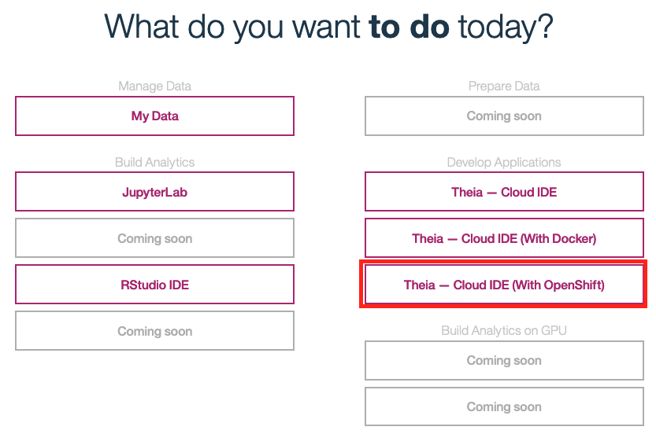
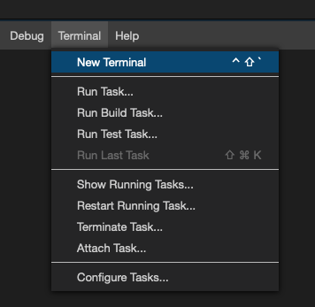

# CognitiveClass.ai

## Access CognitiveClass.ai

1. If you have already registered your account, you can access the lab environment at [https://labs.cognitiveclass.ai](https://labs.cognitiveclass.ai) and login.

1. Navigate to [https://labs.cognitiveclass.ai/register](https://labs.cognitiveclass.ai/register),

    

1. Create a new account with your existing `IBM Id.`

    

1. Alternative, you can choose to use a Social login (LinkedIn, Google, Github or Facebook), or for using your email account click the `Cognitive Class` button,

1. Click `Create an Account`,

1. Fill in your Email, Full Name, Public Username and password, click on the check boxes next to the `Privacy Notice` and `Terms of Service` to accept them. Then click on `Create Account`.

1. You will then be taken to a page with a list of sandbox environments. Click on the option for **Theia - Cloud IDE (With OpenShift)**

    

1. Wait a few minutes while your environment is created.

    

1. You will be taken to a blank editor page once your environment is ready.

1. What we really need is access to the terminal. Click on the `Terminal` tab near the top of the page and select **New Terminal**

    

1. You can then click and drag the top of the terminal section upwards to make the terminal section bigger.

    
