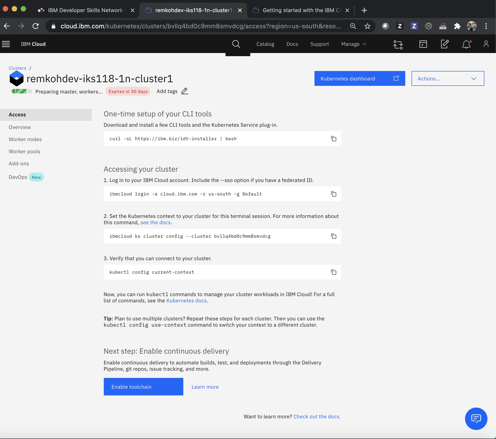

# Create Free Kubernetes Cluster

## Prerequirements

* Free IBM Cloud account, to create a new IBM Cloud account go [here](https://ibm.github.io/workshop-setup/NEWACCOUNT/).
* Free IBM Cloud `Pay-As-You-Go` account, to upgrade to a `Pay-As-You-Go` account go [here](https://ibm.github.io/workshop-setup/PAYASYOUGO/)
* IBM Cloud CLI with the Kubernetes Service plugin, see the [IBM Cloud CLI Getting Started](https://cloud.ibm.com/docs/cli?topic=cli-getting-started), or use a pre-installed client environment like the Labs environment at CognitiveClass,
* CognitiveLabs.ai account, to access a client terminal at CognitiveLabs.ai, go [here](https://ibm.github.io/workshop-setup/COGNITIVECLASS/).

## Using UI

* Log in to [IBM Cloud](https://cloud.ibm.com),
* Go to the [Services Catalog](https://cloud.ibm.com/catalog),


* Filter the services by `Kubernetes`,
* Click the `Kubernetes Service` tile,
* Or go to the [Create Kubernetes Service](https://cloud.ibm.com/kubernetes/catalog/create) page directly,


* Configure the Kubernetes cluster as follows:
  * For `Pricing plan` select `Free`. The page options will reload, leaving the default Kubernetes version as your only option,
  * At the time of writing, the default Kubernetes version was set to `1.18.13`,
  * Under `Orchestration service`, edit the `Cluster name` to a globally unique name, I recommend to follow a format like `username-iks118-1n-cluster1`, where `iks118` represents your Kubernetes version, `1n` the number of worker nodes, and `cluster1` represents your cluster number, in case you have more than 1 cluster.
  * For `Resource Group` keep the `Default` resource group, unless you have created a new resource group and want to use your own resource group,


* Click `Create` to initiate the create cluster request,
* You will be forwarded to the `Access` details for the new cluster,



## Using CLI

To create a free Kubernetes Service, you need to be logged in to a free IBM Cloud `Pay-As-You-Go` account.

```console
IBMID=<your ibm id email>
USERNAME=<your short username>

KS_CLUSTER_NAME=$USERNAME-iks118-1n-cluster1
KS_ZONE=dal10
KS_VERSION=1.18
KS_FLAVOR=u3c.2x4
KS_WORKERS=1
KS_PROVIDER=classic

ibmcloud ks zone ls --provider $KS_PROVIDER
ibmcloud ks flavors --zone $KS_ZONE --provider $KS_PROVIDER
ibmcloud ks versions

ibmcloud login -u $IBMID

ibmcloud ks cluster create $KS_PROVIDER --name $KS_CLUSTER_NAME --zone $KS_ZONE --version $KS_VERSION --flavor $KS_FLAVOR --workers $KS_WORKERS
```

The response should display similar output as,

```console
$ ibmcloud ks cluster create $KS_PROVIDER --name $KS_CLUSTER_NAME --zone $KS_ZONE --version $KS_VERSION --flavor $KS_FLAVOR --workers $KS_WORKERS

Creating cluster...
OK
Cluster created with ID bvlntf2d0fe4l9hnres0
```

Retrieve details of the new cluster,

```console
ibmcloud ks cluster get --cluster $KS_CLUSTER_NAME --output json
```
