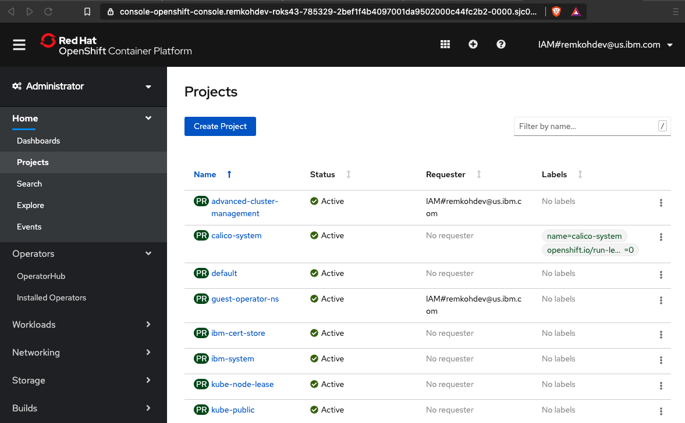
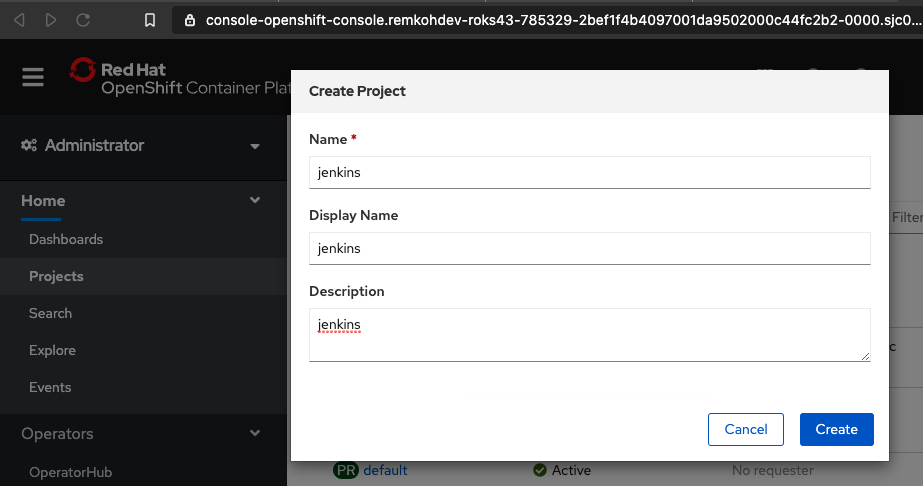
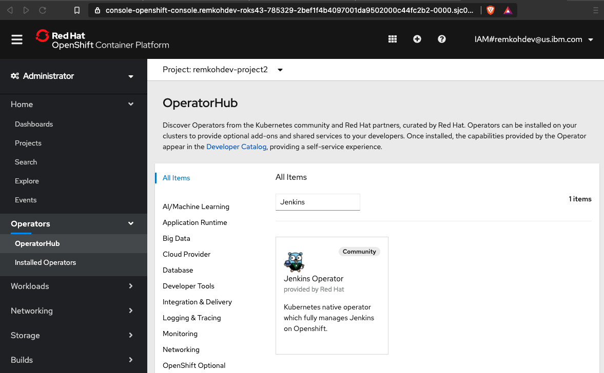
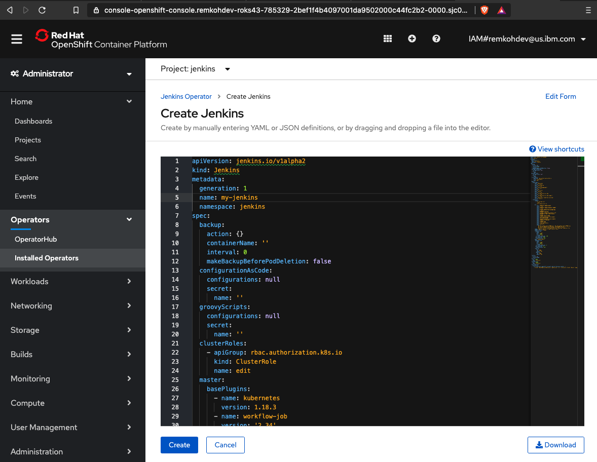
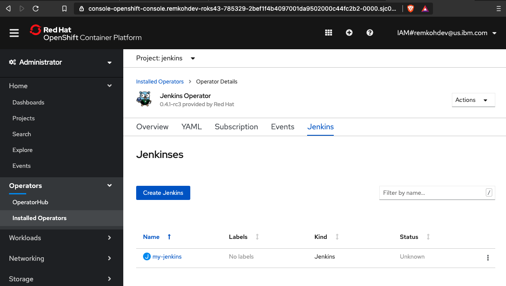
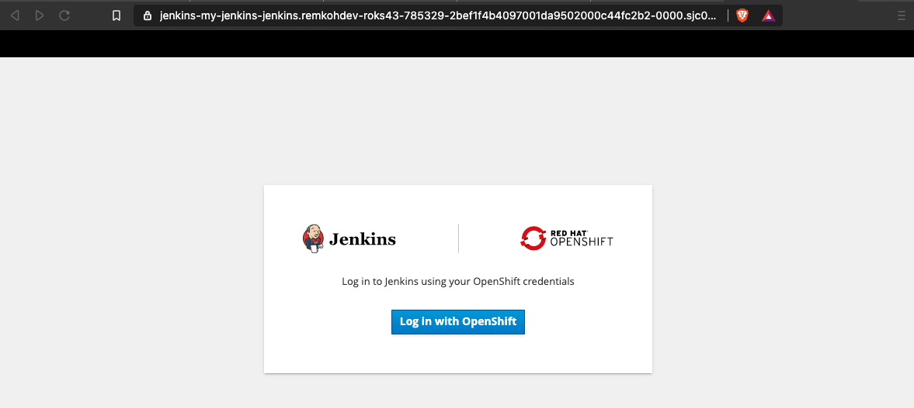
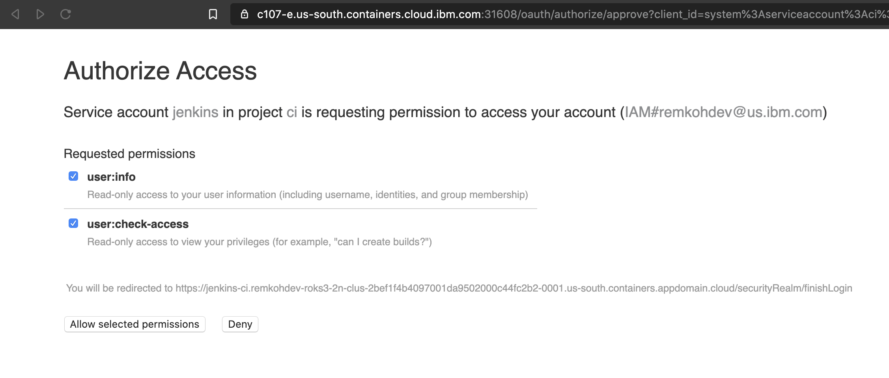
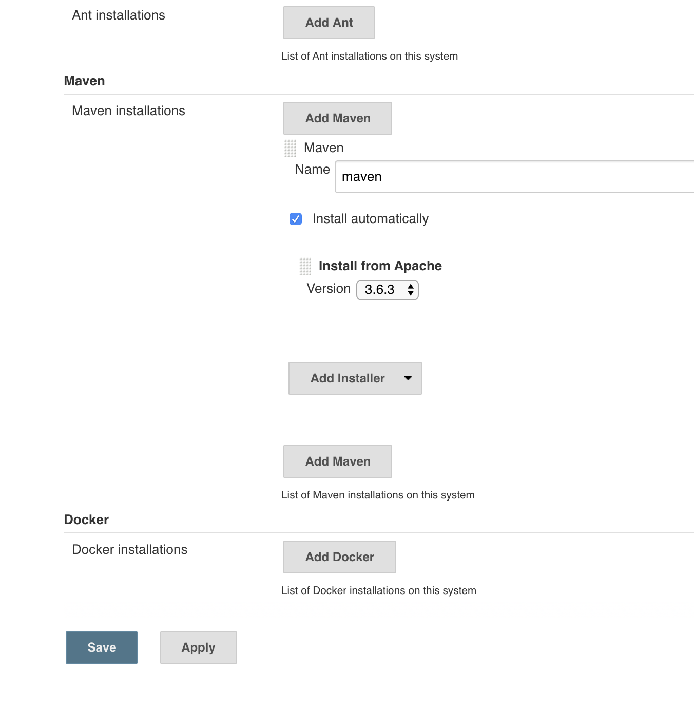

# Jenkins

## Pre-requirements

* OpenShift 4.x cluster

## Setup

1. From the IBM Cloud cluster dashboard, click the `OpenShift web console` button,

    

1. First we need to create a new project named `jenkins` to deploy the Jenkins service to,

1. From the terminal,

    ```console
    oc new-project jenkins
    ```

    outputs,

    ```console
    $ oc new-project jenkins
    Now using project "jenkins" on server "https://c107-e.us-south.containers.cloud.ibm.com:31608".
    ```

1. Or in the Openshift web console, go to `Home` > `Projects`,
1. Click `Create Project`

    

1. For `Name` enter `jenkins`, for `Display Name` enter `jenkins`, and for `Description` enter `jenkins`,

    

1. Click `Create`,
1. Go to `Operators` > `OperatorHub`,
1. For `Filter by keyword` enter `Jenkins`,

    

1. Select the `Jenkins Operator` `provided by Red Hat`, labeled `community`,
1. Click `Continue` to `Show Community Operator`,

    

1. Review the operator information, and click `Install`,

    

1. In the `Install Operator` window, in the `Update Channel` section, select `alpha` under `Update Channel`, choose `A specific namespace in the cluster` and in the `Installed Namespace` section, select the project `jenkins` from the dropdown, select `Automatic` under `Approval Strategy`,

    

1. Click `Install`,
1. The `Installed Operators` page will load, wait until the `Jenkins Operator` has a `Status` of `Succeeded`,

    

1. Click the installed operator linked `Name` of `Jenkins Operator`,

    

1. In the `Provided APIs` section, click the `Create Instance` link in the `Jenkins` panel,
1. In the `Create Jenkins` window, select `Form View` or `YAML View` for the new Jenkins instance, change the `metadata.name` to `my-jenkins`, accept all other specifications,

    

1. Click `Create`,

    

1. Go to `Networking` > `Routes`, and look for a new Route `jenkins-my-jenkins`,

    

1. Click the link for `jenkins-my-jenkins` route in the `Location` column,

    

1. A route to your Jenkins instance opens in a new browser window or tab,
1. If your page loads with a `Application is not available` warning, your Jenkins instance is still being deployed and you need to wait a little longer, keep trying until the Jenkins page loads,
1. You can see the progress of the Jenkins startup, by browsing to the Pods of the Deployment of the Jenkins instance that is being created,
1. Click `Log in with OpenShift`,

    

1. Click `Allow selected permissions`,

    

1. Welcome to Jenkins !

    

1. Configure Jenkins
    1. Go to Jenkins > Manage Jenkins > Global Tool Configuration,
    1. Go to the `Maven` section,
    1. Click `Maven Installations`,
    1. If no Maven installer is configured, click `Add Maven`,
    1. Configure the `Name` to be `maven`, check the option `Install automatically` and select version `3.6.3`,
    1. Click Save,

    
