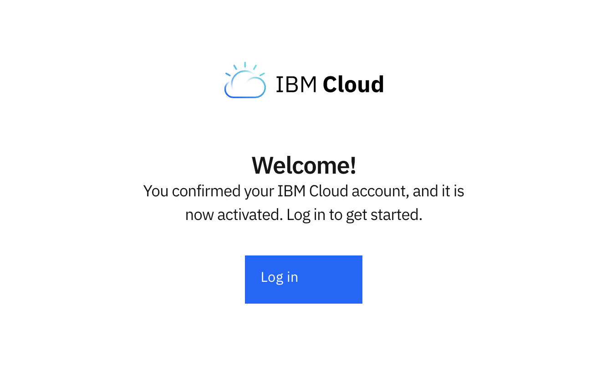

# Create IBM Cloud ID and Account onboarding

Follow the steps below to complete the onboarding process:

1. Open the email invite and click on the `Join now` link.

    

1. In the `Join account` window, enter your name and the password you would like to use. Click the **`Join Account`** button.

    

1. At the `Account activation confirmation` page, click the **`Log in`** button.

    

1. Enter the account landing page with the **`Dashboard`** on dislay. At the top, towards right, the account information is shown.

    

1. You have successfully onboarded the IBM Cloud account.
