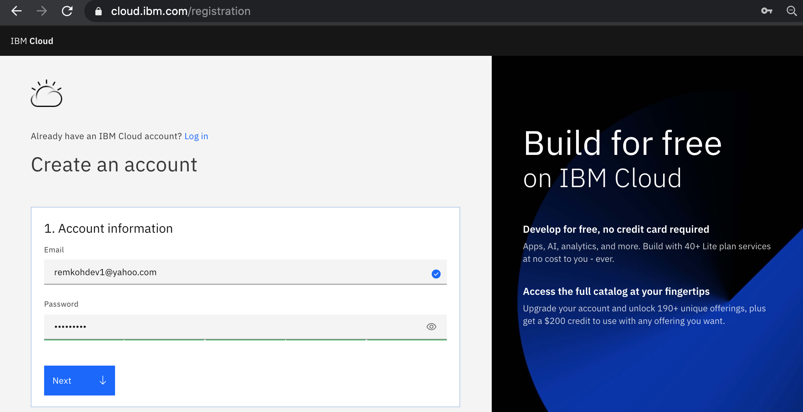
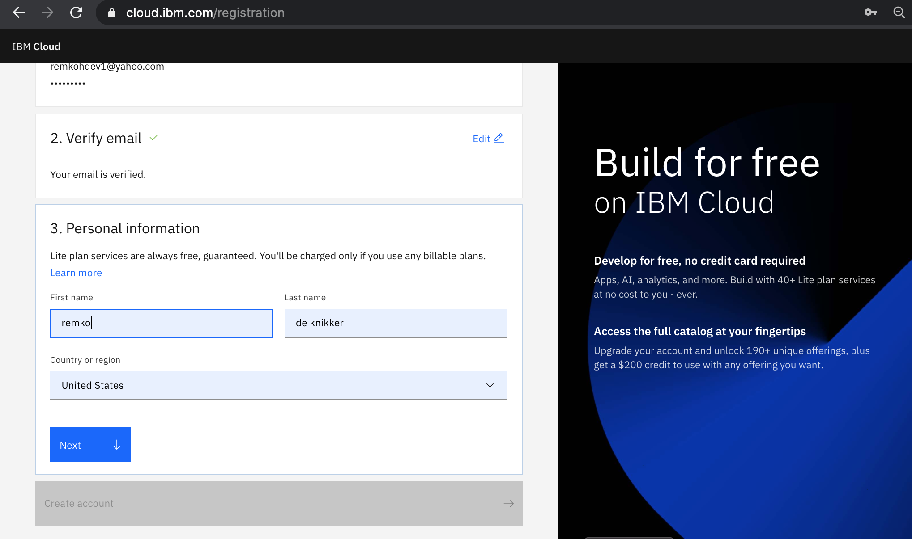
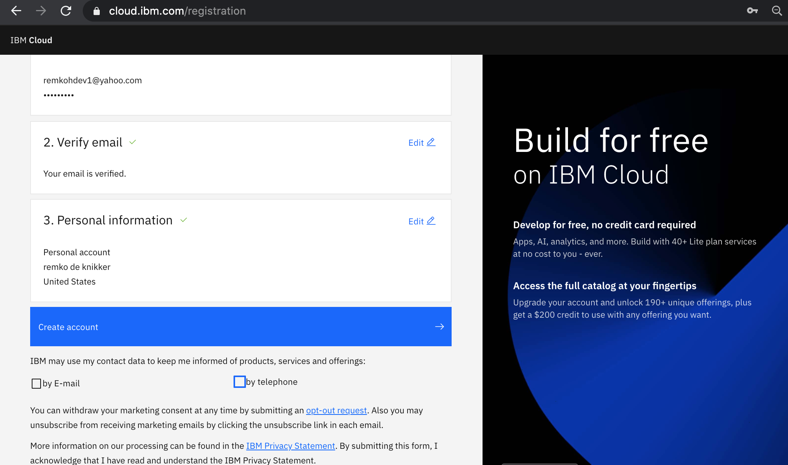
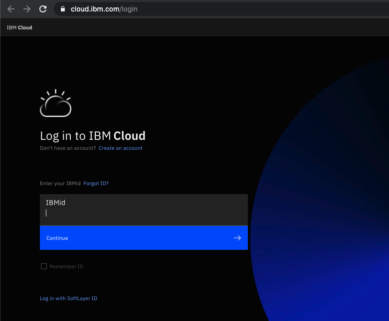
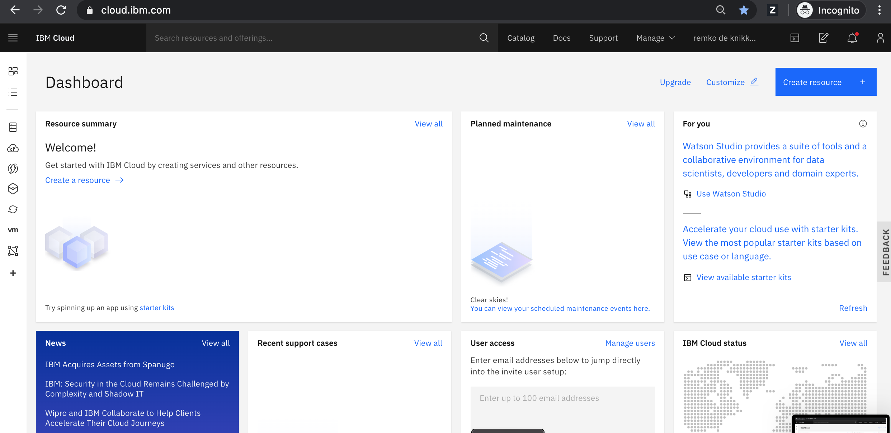

# Create IBM Cloud ID / Account

To create a new account, follow the steps below,

1. Open a web browser and go to the [IBM Cloud Sign up page](https://ibm.biz/Bdfxpq)

   

1. In the `Create an account` window, enter your company email id and the password you would like to use. Click the **`Next`** button.

    

1. The `Verify email` section will inform you that a verification code was sent to your email.

    

1. Switch to your email provider to retrieve the verification code. Then enter the verification code in the `Verify email` section, and click the **`Next`** button.

    

1. Enter your first name, last name and country in the `Personal information` section and click the **`Next`** button.

    

1. Click the **`Create account`** button.

    

1. After your account is created, review the `IBM Privacy Statement`. Then scroll down and click the **`Proceed`** button to acknowledge the privacy statement.

    

1. You are now ready to login to the IBM Cloud. Open a web browser to the [IBM Cloud console](https://cloud.ibm.com). If prompted, enter your IBM Id (the email ID you used to create the account above) followed by your password to login.

    

1. The IBM Cloud dashboard page should load.

    

1. You have successfully registered a new IBM Cloud account.
