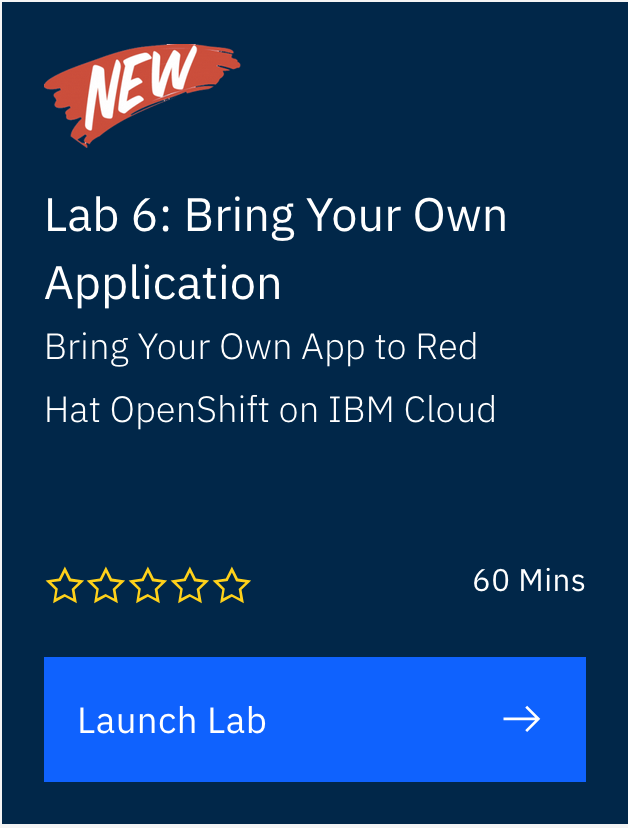
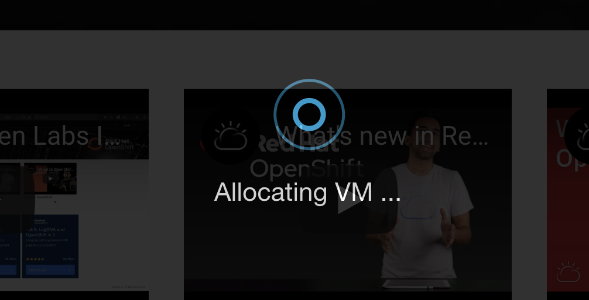

# Access OpenShift Cluster at OpenLabs

These instructions will walk you through how you can get access to a 2 node OpenShift cluster on IBM Cloud through IBM OpenLabs. This cluster will only be available for 2 hours and then will be deleted.

1. Go to IBM OpenLabs: <https://developer.ibm.com/openlabs/openshift>

1. Find the lab in the `Hands on Labs` section called `Lab 6: Bring Your Own App`

    

1. You will be asked to sign into IBM Cloud if you aren't already or you can register for a new account.

    

1. Once you sign in the lab will automatically continue provisioning. You may see messages like `Allocating VM` and so on.

    

1. When that is done you should be taken to a new page that has documentation on the left half of the screen along with a terminal environment on the right. If not, click on the `Lab 6: Bring Your Own App` button again.

    

1. To access your new OpenShift Cluster, click on the tab on the left side of the page labeled `Quick Links and Common Commands` From this page you can access the OpenShift Web Console and find instructions on how to log in to the cluster in the terminal with the oc cli tool.

    
