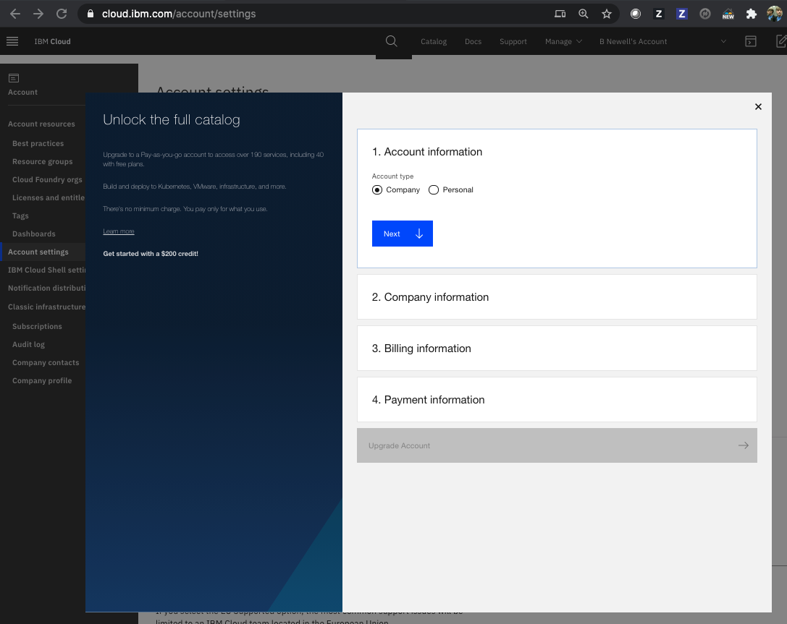
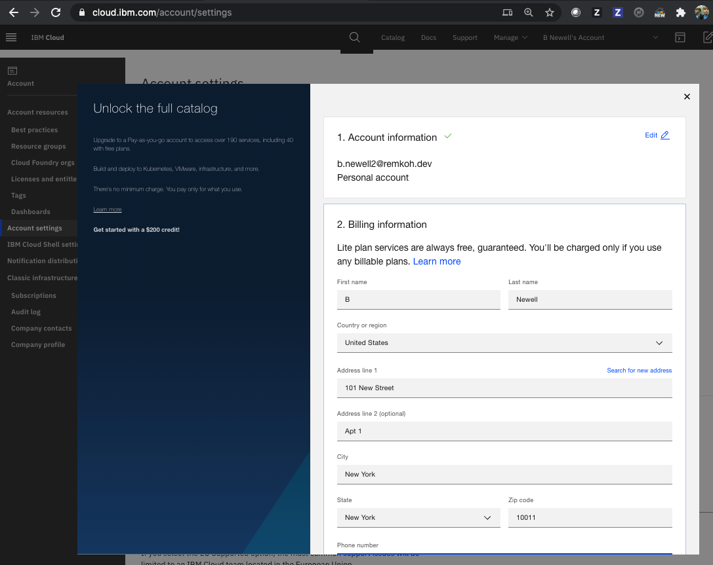

# Upgrade to Pay-As-You-Go Account

1. Login to your [IBM Cloud account](https://cloud.ibm.com/login),
1. Go to [account settings](https://cloud.ibm.com/account/settings),

1. Click the `Add credit card` button, to create the `Pay-As-You-Go` account, which will unlock the full catalog,

1. Select the `Account type`, choose between `Company` and `Personal`. For the setup, I will choose `Personal`. Click `Next`,

1. Enter your `Billing Information`, click `Next`,

1. Enter your `Payment information`, click `Next`,

1. Acknowledge that your card will not be charged, but a $1.00 hold will be placed while authorizing the card,
1. Click `Upgrade Account`,

1. You will receive $200 credit, in case you want to use paid services,
1. Click `Done`,
1. Under `Account settings` you should now see `Account Type` as `Pay-As-You-Go`.
1. Go to the [IBM Cloud Catalog](https://cloud.ibm.com/catalog) and filter [Free and Lite services](https://cloud.ibm.com/catalog?search=label%3Alite%20label%3Afree#services).

## Free and Lite Services

At the time of writing this setup 115 free and lite services were listed, among other:

* Analytics Engine,
* API Connect,
* API Gateway,
* App Connect,
* App ID,
* Auto Scale for VPC,
* Certificate Manager,
* Cloudant,
* Code Engine,
* Container Registry,
* Continuous Delivery,
* DB2,
* Direct Link Connect,
* Discovery,
* Event Streams with Kafka,
* Hyper Protect,
* LogDNA,
* Sysdig,
* IBM Cognos,
* Internet of Things Platform,
* Internet Services with CloudFlare,
* Key Protect,
* Knowledge Studio,
* Kubernetes Service,
* Language Translator,
* Load Balancer for VPC,
* Machine Learning,
* MQ,
* Natural Language Classifier,
* Natural Language Understanding,
* Object Storage,
* PagerDuty,
* Schematics with Terraform,
* Secrets Manager,
* Secure Gateway,
* Speech to Text,
* SQL Query, Object Storage with ANSI SQL,
* Streaming Analytics,
* Text to Speech,
* Tone Analyzer,
* Toolchain,
* Twilio,
* Visual Recognition,
* Voice Agent with Watson,
* Watson Assistant,
* Watson Knowledge Catalog,
* Watson OpenScale,
* Watson Studio,
